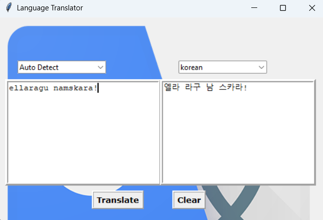

Google Translator using Python

This is a simple GUI-based Language Translator using `Tkinter` and `deep_translator`.  
It allows you to translate text into different languages using Google Translator API.

📸 Output Screenshot

💻 Technologies Used
- Python
- Tkinter
- deep_translator
- PIL (Pillow)
